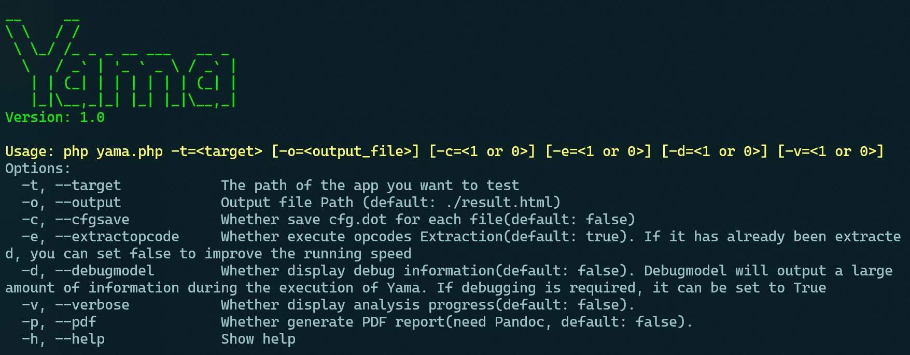

# Yama: Precise Opcodes-based Data Flow Analysis for Detecting PHP Applications Vulnerabilities

Yama, a context-sensitive and path-sensitive interprocedural data flow analysis method for PHP, used to detect taint-style vulnerabilities in PHP applications. Our approach is based on the observation that PHP opcodes have precise semantics and clear control flow, which can make data flow analysis more precise and efficient.

Yama successfully discovered and reported 38 zero-day vulnerabilities in 24 GitHub projects with over 1,000 stars, and 34 new CVE IDs have been assigned:

* [CVEs](#cves)

Due to space limitations, the semantic parsing rules for opcodes and the experimental results of reclassifying each test case in RQ2 can be found here:

* [opcodesSemantics](xjzzzxx/Yama/Yama_appendix/opcodesSemantics.pdf)
* [RQ2details](xjzzzxx/Yama/Yama_appendix/RQ2details.pdf)

# Preview
**Yama's complete code and datasets will be published after the paper is accepted.**

* [Yama_src](xjzzzxx/Yama/Yama_src)
* [Yama_datasets](xjzzzxx/Yama/Yama_dataset)

# CVEs

* CVE-2024-41376
* CVE-2024-41373
* CVE-2024-41374
* CVE-2024-41375
* CVE-2024-44795
* CVE-2024-44797
* CVE-2024-44793
* CVE-2024-41350
* CVE-2024-41351
* CVE-2024-43418
* CVE-2024-41367
* CVE-2024-41368
* CVE-2024-41361
* CVE-2024-41364
* CVE-2024-41366
* CVE-2024-41369
* CVE-2024-41380
* CVE-2024-41381
* CVE-2024-41345
* CVE-2024-41346
* CVE-2024-41347
* CVE-2024-41348
* CVE-2024-41370
* CVE-2024-41371
* CVE-2024-41372
* CVE-2024-41353
* CVE-2024-41354
* CVE-2024-41355
* CVE-2024-41356
* CVE-2024-41357
* CVE-2024-41358
* CVE-2024-44794
* CVE-2024-44796
* CVE-2024-41349