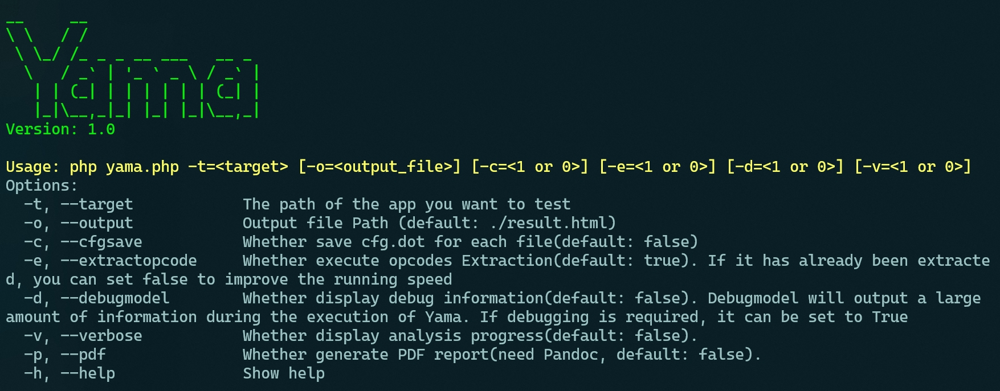

# Yama: Precise Opcode-based Data Flow Analysis for Detecting PHP Applications Vulnerabilities

Yama, a context-sensitive and path-sensitive interprocedural data flow analysis method for PHP, used to detect taint-style vulnerabilities in PHP applications. Our approach is based on the observation that PHP opcodes have precise semantics and clear control flow, which can make data flow analysis more precise and efficient.

Yama successfully discovered and reported 38 zero-day vulnerabilities in 24 GitHub projects with over 1,000 stars, and 34 new CVE IDs have been assigned:

* [CVEs](#cves)

# Directory

* [Yama_src](https://github.com/xjzzzxx/Yama/blob/main/Yama_src)
* [Yama_datasets](https://github.com/xjzzzxx/Yama/blob/main/Yama_datasets)

# Usage

## Analyze dataset1
`php yama.php -t="..\Yama_datasets\dataset1\dataset1"`

## Analyze dataset2

`php yama.php -t="..\Yama_datasets\dataset2\C1_type_inference"`

`php yama.php -t="..\Yama_datasets\dataset2\C2_Dynamic_nature"`

`php yama.php -t="..\Yama_datasets\dataset2\C3_Buil-in_func"`

## Analyze Sample app

`php yama.php -t=".\app\DVWA-1.9"`

`php yama.php -t=".\app\glpi-10.0.16"`

# Citation/Paper

The link to the corresponding paper will be provided once it is officially accepted and published.

# 📘 Documentation Status

This documentation is still in its early stages, and may contain omissions or incomplete sections. We are actively working to improve and expand the documentation.

# CVEs

* CVE-2024-41376
* CVE-2024-41373
* CVE-2024-41374
* CVE-2024-41375
* CVE-2024-44795
* CVE-2024-44797
* CVE-2024-44793
* CVE-2024-41350
* CVE-2024-41351
* CVE-2024-43418
* CVE-2024-41367
* CVE-2024-41368
* CVE-2024-41361
* CVE-2024-41364
* CVE-2024-41366
* CVE-2024-41369
* CVE-2024-41380
* CVE-2024-41381
* CVE-2024-41345
* CVE-2024-41346
* CVE-2024-41347
* CVE-2024-41348
* CVE-2024-41370
* CVE-2024-41371
* CVE-2024-41372
* CVE-2024-41353
* CVE-2024-41354
* CVE-2024-41355
* CVE-2024-41356
* CVE-2024-41357
* CVE-2024-41358
* CVE-2024-44794
* CVE-2024-44796
* CVE-2024-41349
